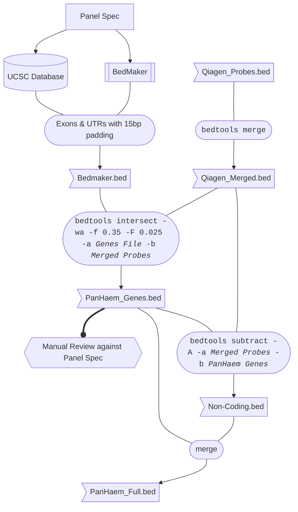

## Qiagen supplied bed files used
- "QIAseq_xHYB.CXHS-11459Z-00.roi-covered-QGEN-ONLY_sorted.bed" = qiagen probes +/-12bp for expected covered regions

## KB workings to produce PanHaem bed files at KCH 
### Input Files

- **BED** Bedmaker Exons & UTRs +/- 15bp
- **BED** Qiagen Probes

### Processing
1. Use Panel Spec (Transcripts) to build "Bedmaker.bed" using Bedmaker & UCSC Database
2. `bedtools merge -i Qiagen_Probes.bed > Qiagen_Merged.bed`
3. `bedtools intersect -wa -f 0.35 -F 0.025 -a bedmaker.bed -b Qiagen_Merged.bed > PanHaem_Genes.bed`
4. Manual review of PanHaem_Genes.bed against Laboratory Panel specification using IGV
5. `bedtools subtract -A -a Qiagen_Merged.bed -b PanHaem_Genes.bed > Non-Coding.bed`
6. `cat PanHaem_Genes.bed Non-Coding.bed > PanHaem_Full.bed`
7. `bedtools sort -i ./PanHaem_Genes.bed > PanHaem_Genes.sorted.bed`
8. `bedtools sort -i ./PanHaem_Full.bed > PanHaem_Full.sorted.bed`

### Diagram

## AS workings for bedmaker sense check (for genes only)
- bedmaker provider with latest lab transcript list and run for those specific transcripts only with 15bp pad and including UTRs (marked in output).
- Where exon hot spots required only, all other exons removed. - exons identified via UCSC table browser using refseq track and table using supplied transcript list. - pasted into excel list. 3 genes not identied via refseq where pull out via gencodev5 and known genes. 
- All UTRs removed apart from that required in ANKKRD26.
- findings after bedtools subtract operations  indicate the bedmarker padding off by 1bp 5' for all exons. No pad where coding exon runs into UTR. UTRs reatined in KB Genes bed file. 

## history of additional bed file work:
`bedtools subtract -b QIAseq_xHYB.CXHS-11459Z-00.roi-covered-QGEN-ONLY_sorted.bed -a PanHaem_Full.merged.bed `

chr1	1825496	1825514	GNB1_exon_3,GNB1_utr5_3
chr1	36466859	36466923	CSF3R_exon_17
chr1	43337802	43337815	MPL_exon_1,MPL_utr5_1
chr1	64886332	64886356	JAK1_exon_2,JAK1_utr5_2
chr10	110567679	110567751	SMC3_exon_1,SMC3_utr5_1
chr11	534354	534390	HRAS_exon_2,HRAS_utr5_2
chr11	108227579	108227588	ATM_exon_2,ATM_utr5_2
chr12	111418103	111418123	SH2B3_exon_2,SH2B3_utr5_2
chr13	72781864	72781915	DIS3_exon_1,DIS3_utr5_1
chr17	1684593	1684597	PRPF8_exon_2,PRPF8_utr5_2
chr17	7676629	7676637	TP53_exon_2,TP53_utr5_2
chr19	1650284	1650302	TCF3_exon_2,TCF3_utr5_2
chr19	12943752	12943819	CALR_exon_9
chr19	17844439	17844445	JAK3_exon_2,JAK3_utr5_2
chr19	33302514	33302549	CEBPA_exon_1,CEBPA_utr5_1
chr2	136118124	136118164	CXCR4_exon_1,CXCR4_utr5_1
chr21	35048942	35048973	RUNX1_exon_2,RUNX1_utr5_2
chr3	128487063	128487091	GATA2_exon_2,GATA2_utr5_2
chr5	177516966	177516976	DDX41_exon_1,DDX41_utr5_1
chr7	2958574	2958646	CARD11_exon_2,CARD11_utr5_2
chr8	116866751	116866776	RAD21_exon_2,RAD21_utr5_2
chr9	5021947	5021955	JAK2_exon_3,JAK2_utr5_3
chrX	15823274	15823275	ZRSR2_exon_11,ZRSR2_utr3_1
chrX	40077958	40077984	BCOR_exon_2,BCOR_utr5_2
chrX	48791075	48791081	GATA1_exon_2,GATA1_utr5_2
chrX	53422632	53422669	SMC1A_exon_1,SMC1A_utr5_1
chrX	101375316	101375329	BTK_exon_2,BTK_utr5_2
chrX	124022515	124022577	STAG2_exon_3,STAG2_utr5_3
chrX	130005172	130005202	BCORL1_exon_2,BCORL1_utr5_2

- remove calR from above as this is special case where we require coverage over exon 9 but need to place probes esither side of known deletion loci - hence predicted drop in coverage

then perform below operations:

- `bedtools subtract -b QIAseq_xHYB.CXHS-11459Z-00.roi-covered-QGEN-ONLY_sorted.bed -a PanHaem_Full.merged.bed > utr_to_remove.bed`

- `bedtools subtract -a PanHaem_Genes.merged.bed -b utr_to_remove.bed >  PanHaem_Genes.merged_no_UTR.bed`

- `bedtools subtract -a PanHaem_Full.merged.bed -b utr_to_remove.bed > PanHaem_Full.merged_no_UTR.bed`